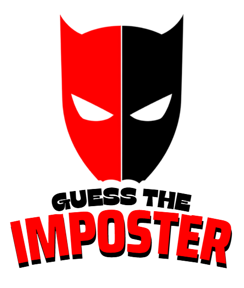

<div align="center">

  

  # 🎭 GUESS THE IMPOSTER

  **Trust no one. Listen closely. Spot the fake.**

  A fast-paced, pass-and-play social deduction party game made to be played in person on a single phone! No downloads, no room codes, and no account setups needed just grab your group and pass the device around.

  [🎮 Play Online Now](https://joelalmeida4972-netizen.github.io/Guess-the-Imposter/) · [Report Bug](https://github.com/joelalmeida4972-netizen/Guess-the-Imposter/issues) · [Request Features](https://github.com/joelalmeida4972-netizen/Guess-the-Imposter/issues)

  ---

  
  
  
  

</div>

<br />

---

## 🎯 The Core Premise

Everyone in the room receives the **same secret word**—except for the **Imposter(s)**.

* **Regular Players:** Know the word. Give clues that are subtle enough to show you're in the loop without giving the word away to the listener!
* **The Imposter:** Has no clue what the word is, but gets a discrete **one-word topic clue**. Listen like an eagle, bluff your turn, and avoid being voted out!

---

## 🕹️ How It Plays Out

| Step | Phase | Action |
| :--- | :--- | :--- |
| **01** | **Setup** | Pick total players (3 to 22) and imposter count (1 to 10). Type names. |
| **02** | **Secret Hand-Off** | The game randomizes the player sequence. Pass the phone as each name is called. |
| **03** | **Role Reveal** | Regular players read the secret word. Imposters see their red alert badge with a subtle topic clue. |
| **04** | **Hint Round** | A randomly selected player starts. Everyone gives one clue around the circle. |
| **05** | **The Vote** | The room debates, points fingers, and votes on who is bluffing! |
| **06** | **Last Chance** | Caught imposter? Guess the exact word to steal victory from the jaws of defeat! |

---

## ✨ Standout Features

* 📱 **Single-Phone Experience:** Runs completely offline or online on any mobile browser without requiring everyone to install an app.
* 🎲 **Anti-Metagame Shuffling:** Role reveals and discussion starters are picked through random permutations, meaning you can never predict an imposter by seat or turn order.
* 🧠 **Nearly 200 Curated Words:** From everyday items to challenging concepts (*Submarine*, *Black Hole*, *Chameleon*, *Espresso*), each paired with a calibrated hint.
* 🌗 **Theme Engine:** Default dark high-contrast theme built for nighttime and party lighting, with a clean light-mode toggle.
* ✍️ **Smooth Mobile Interaction:** Anti-glitch inputs for clean name entries and uninterrupted final imposter guesses.

---

## 🛠️ Built With

* **React 18** (Direct CDN integration, zero complex build tooling needed)
* **Babel Standalone** (Client-side runtime JSX compilation)
* **Modern Vanilla CSS** (Custom fluid layouts, glow effects, responsive card scaffolding)
* **Single-File Architecture:** Entire application packaged in a single standalone `index.html`

---

## 🚀 Running Locally

Want to tweak the word bank or host it on your own network?

1. **Clone the repo:**
   ```bash
   git clone [https://github.com/joelalmeida4972-netizen/Guess-the-Imposter.git](https://github.com/joelalmeida4972-netizen/Guess-the-Imposter.git)